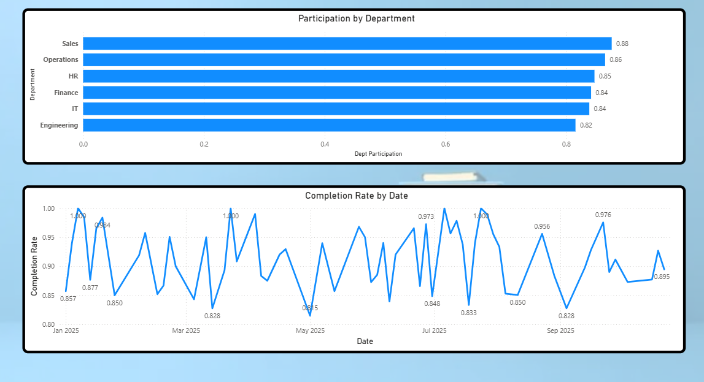

# Learning Analytics & Training ROI Dashboards

This repository contains two interactive dashboards developed using **Power BI** to analyze employee training programs and measure their effectiveness. These dashboards help organizations monitor participation, completion, learning outcomes, and evaluate the ROI of training initiatives.

---

## Projects Overview

### 1. Learning Analytics Dashboard
The Learning Analytics Dashboard tracks virtual training participation and learner engagement, providing actionable insights to improve training effectiveness.

**Key Features:**
- Monitor training participation and completion rates.
- Analyze learner feedback scores to assess training quality.
- Visualize KPIs and metrics for management and stakeholders.
- Identify trends and areas for improvement in training programs.

**Key Metrics Used:**
- Invited, Registered, Attended, Completed
- Feedback Score
- Completion Rate
- Participation Rate

**Dashboard Screenshots:**

| Page 1 | Page 2 |
|----|----|
|  |  |

| Page 3 | Page 4 |
|----|----|
|  

---

### 2. Training ROI Analysis Dashboard
The Training ROI Analysis Dashboard measures the impact of training programs by analyzing pre- and post-training performance metrics, calculating ROI, and identifying trends.

**Key Features:**
- Compare pre-training and post-training performance scores.
- Calculate training benefits and ROI for individual employees and programs.
- Identify trends in productivity and skill adoption.
- Generate visual reports for management decision-making.

**Key Metrics Used:**
- Pre_Score, Post_Score
- Training Benefit (Post_Score − Pre_Score)
- Average Training Benefit
- Training Cost
- ROI (Return on Investment)
- Completion Rate and Participation Rate

**Dashboard Screenshots:**

| Page 1 | Page 2 |
|----|----|
|  |  |

| Page 3 | Page 4 |
|----|----|
|  |  |

---

## Technologies Used
- **Power BI** – For building interactive dashboards and visualizations.
- **Excel** – For data preparation and preprocessing.
- **Python (optional)** – For any data manipulation and calculations before importing to Power BI.

---

## Dataset Description
The dashboards use synthetic training data containing details of employees, training sessions, participation, completion, feedback, pre- and post-training scores, and training costs.

**Columns Include:**
- Employee_ID, Employee_Name, Department  
- Training_ID, Training_Name  
- Invited, Registered, Attended, Completed  
- Pre_Score, Post_Score  
- Date, Training_Cost  
- Feedback_Score  

---

## How to Use
1. Open the `.pbix` Power BI file in **Power BI Desktop**.
2. Ensure the data source (Excel/CSV) is connected.
3. Interact with slicers, filters, and visuals to analyze training participation, completion, and ROI.
4. Export reports as needed for presentations or management reviews.

---

## Author
**Syed Mohammed Luqmaan**  
- Email: [mohammedluqmaan29@gmail.com](mailto:mohammedluqmaan29@gmail.com)  
- LinkedIn: [linkedin.com/MohammedLuqmaan](https://www.linkedin.com/in/mohammed-luqmaan-6a9114218/)  
- GitHub: [github.com/Luqmaan29](https://github.com/Luqmaan29)

---

## License
This project is licensed under the MIT License. See the [LICENSE](LICENSE) file for details.
